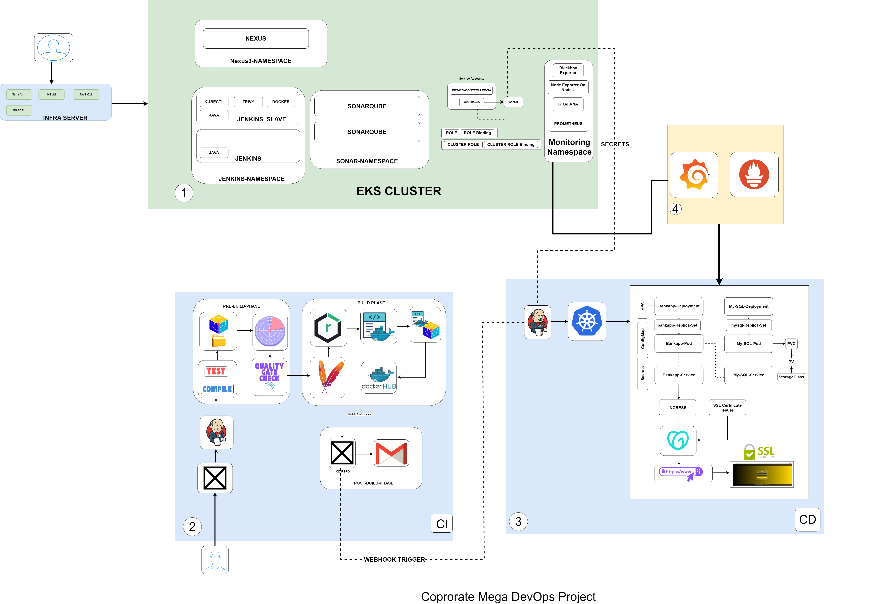

# Multi-Tier Banking Application Deployment on AWS EKS

## Project Overview

This project demonstrates a production-style DevOps architecture where a multi-tier banking application is built, scanned, packaged, containerized, and deployed on Amazon EKS using a complete CI/CD pipeline.

The project includes Infrastructure as Code using Terraform, Continuous Integration using Jenkins, code quality analysis using SonarQube, security scanning using Trivy, artifact management using Nexus, containerization using Docker, and Continuous Deployment to Kubernetes on AWS EKS.

---

## Architecture Diagram



---

## Tech Stack

* AWS EKS
* Terraform
* Kubernetes
* Docker
* Jenkins
* SonarQube
* Trivy
* Nexus Repository
* GitHub
* IAM OIDC
* AWS EBS CSI Driver

---

## Project Structure

```
application/              Bank application source code
Terraform-Code/           Infrastructure provisioning for EKS
Manifest-Code/            Kubernetes deployment manifests
docs/                     Documentation and architecture diagrams
```

---

## CI/CD Pipeline Workflow

### Continuous Integration (CI)

The CI pipeline is implemented using Jenkins and includes the following stages:

1. Git checkout from GitHub repository
2. Maven compile
3. Unit testing
4. File system vulnerability scan using Trivy
5. Static code analysis using SonarQube
6. Quality Gate validation
7. Package application using Maven
8. Publish artifacts to Nexus Repository
9. Build Docker image
10. Tag Docker image with build number and latest
11. Scan Docker image using Trivy
12. Push Docker image to DockerHub

This ensures that only quality-checked and security-scanned artifacts are used for deployment.

---

### Continuous Deployment (CD)

The CD pipeline deploys the application to Amazon EKS:

1. Checkout Kubernetes manifests from GitHub
2. Connect to EKS cluster using kubeconfig credentials
3. Deploy MySQL database using Kubernetes deployment
4. Deploy Banking application using Kubernetes deployment
5. Wait for rollout status of deployments
6. Verify pods status
7. Verify services
8. Expose application using Kubernetes Service of type LoadBalancer
9. Retrieve external LoadBalancer URL for application access

---

## Deployment Workflow (End-to-End)

Developer → GitHub → Jenkins CI Pipeline → Build & Test → SonarQube Analysis → Trivy Security Scan → Nexus Artifact Repository → Docker Build → DockerHub → Jenkins CD Pipeline → AWS EKS → Kubernetes Deployments → LoadBalancer Service → End Users

---

## Features Implemented

* Infrastructure provisioning using Terraform
* Amazon EKS cluster setup
* IAM OIDC provider integration
* Persistent storage using AWS EBS CSI Driver
* Multi-tier application deployment (BankApp + MySQL)
* Jenkins CI pipeline for build, test, scan, and artifact management
* SonarQube for static code analysis
* Trivy for vulnerability scanning (file system and container image)
* Nexus repository for artifact storage
* Docker image build and push to DockerHub
* Jenkins CD pipeline for Kubernetes deployment
* Application exposed using Kubernetes LoadBalancer Service
* Automated deployment verification using rollout status

---

## Future Enhancements

* Ingress Controller
* Horizontal Pod Autoscaler (HPA)
* Prometheus & Grafana Monitoring
* GitOps using ArgoCD
* Helm Charts
* Blue-Green Deployment

---

## Author

Sneha Basuthkar
Senior Cloud Engineer | AWS | Kubernetes | Terraform | Docker | Jenkins
